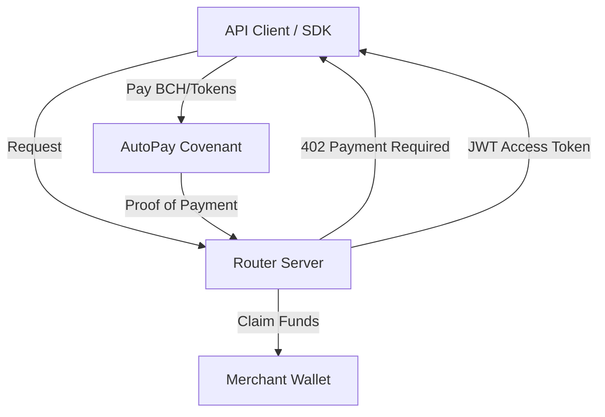

# CashFlow402: Bitcoin Cash HTTP-402 & Recurring Payments Protocol

**Version**: 1.0  
**Status**: MVP Development  
**Target Network**: ChipNet (BCH Testnet)

---

## 1. Executive Summary
CashFlow402 is a developer middleware SDK and recurring payments protocol built natively on Bitcoin Cash. It combines **HTTP-402 "Payment Required"** micropayment routing with **CashToken-based subscription management** via BCH covenants. By leveraging BCH's sub-cent transaction fees and the 2025 VM upgrades (BigInt), it enables economically viable micropayment streams (e.g., 1 sat/sec) for APIs and digital services.

---

## 2. Problem Statement
1.  **High Fees**: Traditional payment processors (Stripe/PayPal) take ~3% + $0.30, making sub-$1 transactions impossible.
2.  **Gas Costs**: Existing crypto solutions (Ethereum-based) are too expensive for frequent micropayments.
3.  **Lack of Standards**: HTTP-402 has existed for decades but lacks a standardized, easy-to-implement BCH routing layer.

---

## 3. Core Features (Backend Only MVP)

### 3.1 Auto-Pay Covenants (CashScript)
- **Subscription Factory**: Deploys per-API subscription contracts.
- **Pull-Payment Logic**: Allows merchants to claim authorized amounts trustlessly after specific intervals.
- **CashToken Tiers**: Uses mutable/immutable NFTs to represent subscription status and access levels.
- **Non-Custodial**: Users retain a cancel key to sweep remaining balances.

### 3.2 Payment Router Server (Node.js/Express)
- **HTTP-402 Middleware**: Intercepts unauthorized requests and returns a `402 Payment Required` header with a BIP21-compliant payment challenge.
- **Verification Service**: Monitors the mempool (via Electrum/ChipNet) to confirm payments.
- **JWT Issuance**: Generates short-lived access tokens upon payment verification.

### 3.3 JS SDK
- **Developer Integration**: Simple middleware for Node.js servers.
- **Client Resolution**: Tools for client-side wallets to detect 402 errors, pay the challenge, and retry the request.

---

## 4. Technical Architecture

---

## 5. Implementation Roadmap (2 Weeks)

### Week 1: Infrastructure & Contracts
- **Day 1-2**: Initialize project, setup CashScript environment, and write `AutoPaySubscription.cash`.
- **Day 3-4**: Build the Deployment Factory for subscription contracts.
- **Day 5-7**: Implement the Express Router Server with basic HTTP-402 header logic.

### Week 2: Logic & SDK
- **Day 8-10**: Build the Verification Service (ChipNet monitoring) and JWT generation.
- **Day 11-12**: Develop the JS SDK for automated payment resolution.
- **Day 13-14**: Integration testing, documentation, and demo recording.

---

## 6. Tech Stack
- **Smart Contracts**: [CashScript](https://cashscript.org) (^0.11.0)
- **Backend**: Node.js, Express, TypeScript
- **BCH Libraries**: `libauth`, `bch-js`
- **Network**: ChipNet (BCH Testnet)
- **Tokens**: native CashTokens (CHIP-2022-02)
