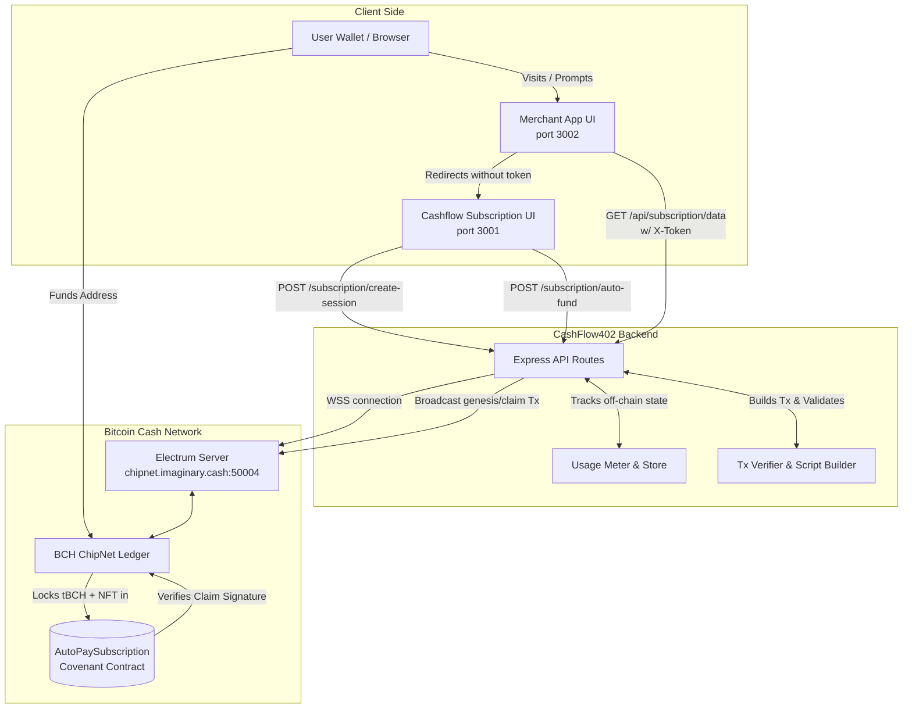

# CashFlow402 Architecture Diagrams

This document contains the core architecture and flow diagrams for the CashFlow402 project. These diagrams use Mermaid syntax, which you can render natively in Markdown viewers, GitHub, or by pasting them into the [Mermaid Live Editor](https://mermaid.live).

## 1. System Architecture / Relayer Flowchart

This flowchart illustrates the high-level architecture of the application, showing how the client side (Merchant App & Cashflow UI), backend API server, and the BCH blockchain interact.

---

## 2. End-to-End Sequence Diagram

This sequence diagram details the exact chronological steps from the moment a user tries to access the merchant's application, to continuous API usage, and finally to the merchant sweeping the earnings on-chain.

```mermaid
sequenceDiagram
    autonumber
    
    actor User
    participant MerchantApp as Merchant App UI
    participant CashflowUI as Cashflow Subscription UI
    participant Backend as CashFlow402 API
    participant Blockchain as BCH ChipNet (Electrum)
    
    User->>MerchantApp: Click "Subscribe to AI Agent"
    MerchantApp->>CashflowUI: Redirect to Cashflow (Missing Token)
    
    rect rgb(20, 30, 45)
        note right of User: Step 1: Covenant Instantiation
        CashflowUI->>Backend: POST /subscription/create-session
        Backend-->>CashflowUI: Return subscriberAddress, temporary WIF, contractAddress
        CashflowUI-->>User: Display Subscriber Address
    end
    
    rect rgb(20, 30, 45)
        note right of User: Step 2: Off-chain Funding
        User->>Blockchain: Transfer tBCH to subscriberAddress (via Wallet/Faucet)
        Blockchain-->>User: Deposit Confirmed
    end
    
    rect rgb(20, 30, 45)
        note right of User: Step 3: Genesis Contract Activation
        CashflowUI->>Backend: POST /subscription/auto-fund
        Backend->>Backend: Build Genesis TX & Mutable NFT
        Backend->>Blockchain: Broadcast Genesis TX
        Blockchain-->>Backend: Return txid (Becomes tokenCategory)
        Backend-->>CashflowUI: Returns activated tokenCategory
    end
    
    CashflowUI->>MerchantApp: Redirect back `?tokenCategory=hex`
    MerchantApp-->>User: Display unlocked UI
    
    rect rgb(20, 30, 45)
        note right of User: Step 4: Gated Service Usage
        User->>MerchantApp: Send AI Prompt
        MerchantApp->>Backend: API Request w/ Header: X-Subscription-Token
        Backend->>Backend: Deduct `perCallSats` from off-chain ledger
        Backend-->>MerchantApp: 200 OK
        MerchantApp-->>User: Display AI Response
    end
    
    rect rgb(20, 30, 45)
        note right of User: Step 5: Merchant On-chain Settlement
        MerchantApp->>Backend: POST /merchant/claim-all
        Backend->>Backend: Calculate un-swept sats securely
        Backend->>Blockchain: Broadcast signed CashScript Claim TX
        Blockchain-->>Backend: Sweep funds from contract to Merchant Wallet
        Backend-->>MerchantApp: Return Settlement TXIDs
    end
```

